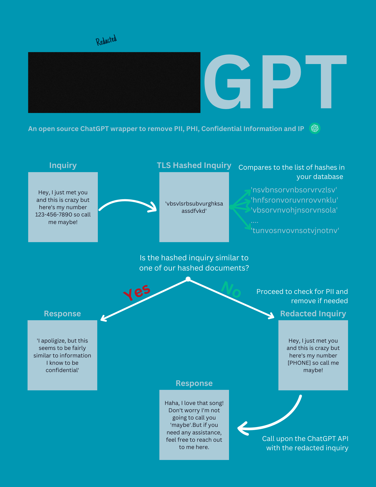

# PII, PHI, IP scrubber for ChatGPT

## Watch demo here: https://youtu.be/ldUYTdizbVg

## Update: You can now flag confidential information as well. See Hashing Section.

# How it works:

When you write an inquiry to RedactedGPT the first thing it does is apply a the [Trend Micro Locality Sensitive Hash](https://github.com/trendmicro/tlsh) and compares that hash with the TLS Hashes you have added to your database for possible leakage. 
_Note: When you add a document (instructions below), only the the hash is saved, not the document. The document is immediately deleted so even though the app lives entirely within your network, not even the app knows what's on the document. This is really important for security purposes._

If it is similar enough it will not send the inquiry to ChatGPT and it will alert the user that it can't proceed because it seems to be similar to information we deem confidential.

If the app determines that the inquiry is not that similar to the hashes of your confidential documents, it then applies a PII removal as an additional security control. 

Only then it sends the information to ChatGPT via API and returns an answer to the user.

As an additional note: the ChatGPT API doesn't store information for more than 30 days and inquiries via the API are not used to retrain their models.

## How to run it:

Add your API Key to the _.env_ inside the _app_ folder and _scanner_ folder, and your database credentials to the _.env_ inside the _scanner folder as well as to the _docker-compose.yml_ file.

For testing purposes I've inserted a fake username and password so that you can track it across all the files mentioned above. Please, please, please, make sure you __change the username and password__ to a more secure one. These are only there for the intended purpose of showing you how it works.

## From the main folder run the commands:

_docker-compose build_

(include the _--no-cache_ at the end of the command if needed)

_docker-compose up_

(include the _--force-recreate_ at the end of the command if needed)

## RedactedGPT

Open a browser on _0.0.0.0:8000_ and enjoy!

## Hashing 
### Storing a (only the) hash of your confidential or protected documents 

We now have the capability to save a [Locality Sensitive Hash](https://github.com/trendmicro/tlsh) for the confidential information you don't want your org to paste into ChatGPT. When someone makes an inquiry to RedactedGPT, the first thing it'll do is check if the hash of the inquiry is relatively similar to the hash of any of the documents you don't want leaked and if it is, it won't send the inquiry to ChatGPT and it will inform the user.

To save the hash of a document follow the following command from your terminal

_curl -F "file=@your_file.docx" http://localhost:8002/upload_

### References:

I'm using the API call from this tutorial: #https://www.twilio.com/blog/integrate-chatgpt-api-python

I obtained the PII remover function from a ChatGPT prompt!

As you can probably tell I'm a huge fan of TLSH from Trend Micro. Here's the code: https://github.com/trendmicro/tlsh

### Future updates:

- Build a separate module for the PII removal that import the functions into the flask App, that way we can add more regex more easily.

- Build a separate module for the hash functions.

- Add other document types to the hashing module.

- Improve the page to be responsive.

- Record Partial hashes for docs for example by pages

- Clusters hashes on the table by distance and create a column for the cluster label. That way we don't have to compare in real time against all hashes but select a random sample of each cluster instead.

- Document how to set a good threshold

- As of right now, the container for the webapp runs before the table on the database is created at first, I need to fix that.

- Also in order for documents to refresh we need to restart the _app_ container. Still debating if I want to pull in the table with every inquiry or every now and then. I guess it will depend on how often a company plans to add files to it.

### Feel free to make improvements and send merge request if you do.

